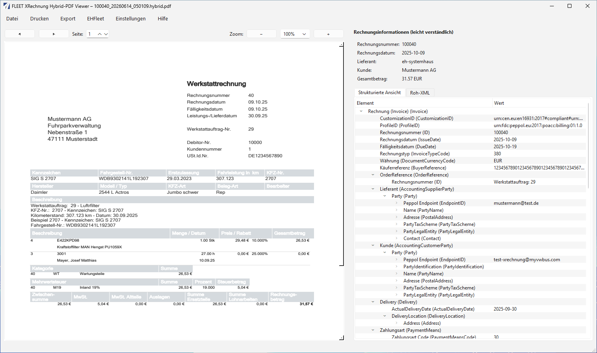
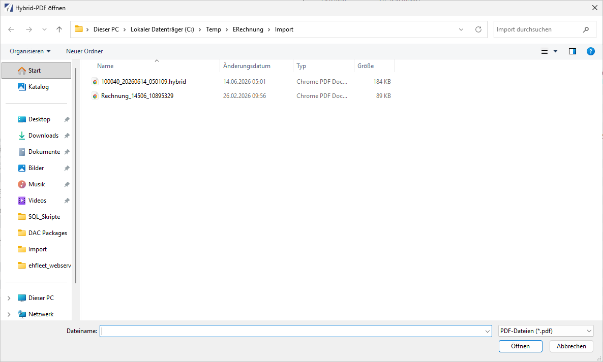
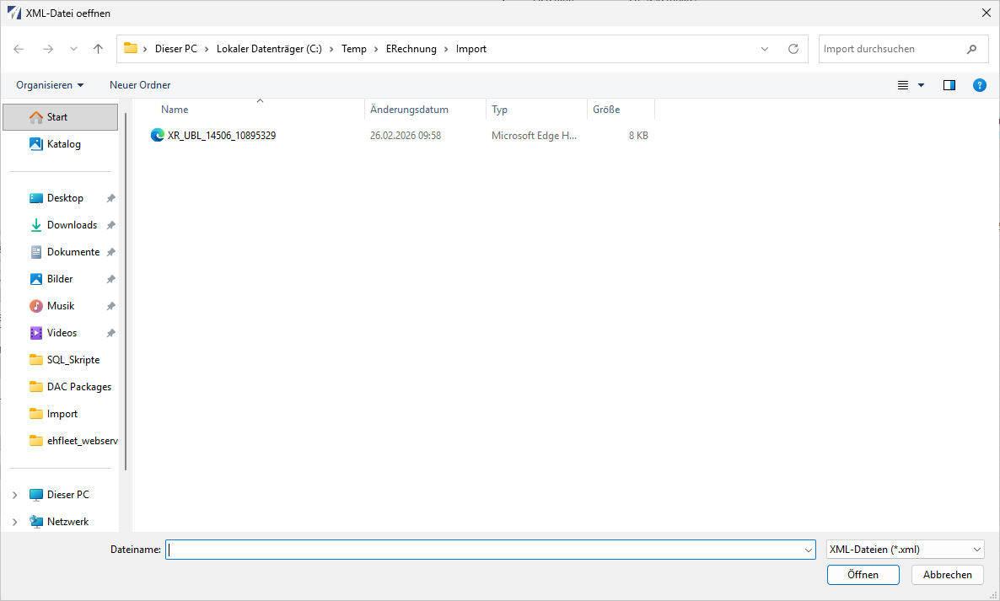
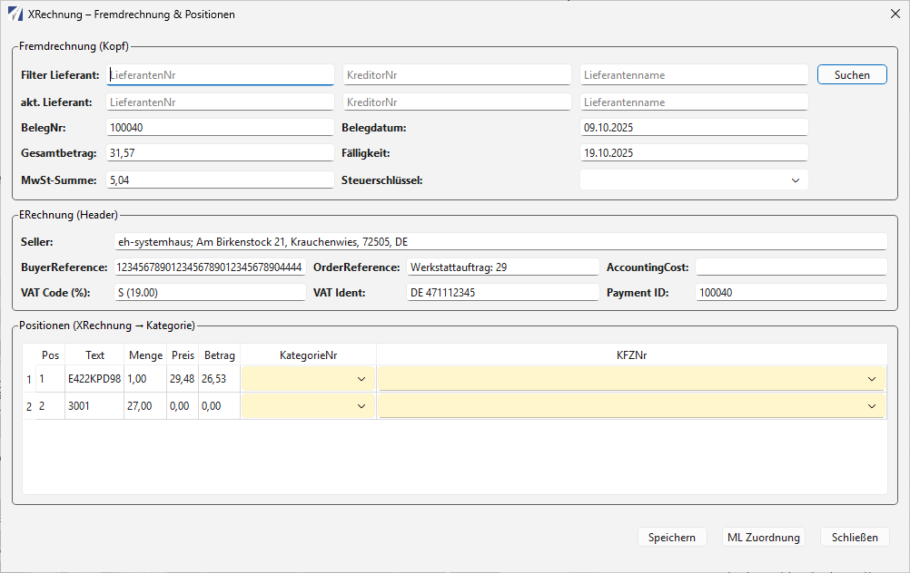
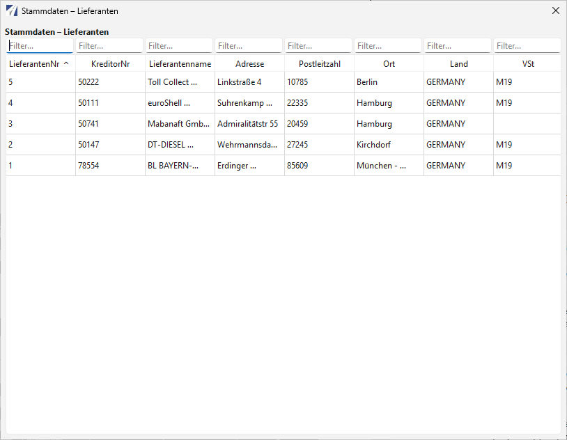
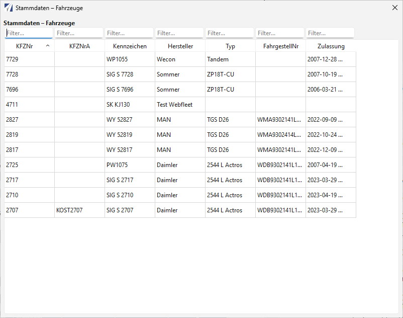
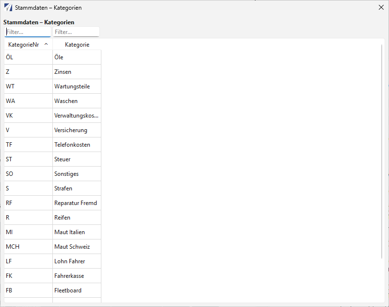
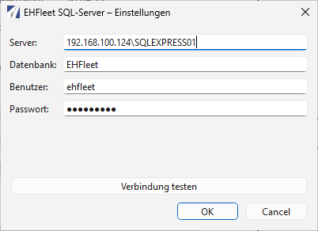

# Handbuch

## Überblick

Der FLEET XRechnung Hybrid-PDF Viewer unterstützt die Prüfung elektronischer Eingangsrechnungen. Anwender können Hybrid-PDFs oder XML-Dateien öffnen, strukturierte Rechnungsdaten kontrollieren, Validierungsberichte anzeigen und Rechnungspositionen für die Weiterverarbeitung in EHFleet zuordnen.

*Hauptfenster mit PDF-Vorschau links und Rechnungsinformationen sowie XML-Struktur rechts.*

## Datei öffnen

### Hybrid-PDF öffnen

1. `Datei -> PDF öffnen...` wählen.
2. Hybrid-PDF auswählen.
3. Die Anwendung zeigt links das PDF und rechts die extrahierten Rechnungsinformationen.
4. In den Tabs kann zwischen strukturierter Ansicht und Roh-XML gewechselt werden.

*Auswahl eines Hybrid-PDFs mit eingebetteter XRechnung.*

### XML öffnen

1. `Datei -> XML öffnen...` wählen.
2. XRechnung-XML auswählen.
3. Die strukturierte Ansicht und das Roh-XML werden geladen.

*Direktes Öffnen einer XRechnung-XML-Datei.*

### Drag & Drop

PDF- und XML-Dateien können direkt auf das Hauptfenster gezogen werden. Die Anwendung erkennt den Dateityp und lädt die passende Ansicht.

## Rechnungsdaten prüfen

Die rechte Seitenleiste zeigt die wichtigsten Rechnungsinformationen in leicht verständlicher Form:

- Rechnungsnummer
- Rechnungsdatum
- Lieferant
- Kunde
- Gesamtbetrag

Die strukturierte Ansicht zeigt die XML-Elemente als Baum. Damit lassen sich einzelne Felder, Referenzen, Steuerdaten, Zahlungsinformationen und Parteien nachvollziehen.

## XRechnung validieren

1. Rechnung öffnen.
2. `EHFleet -> XRechnung prüfen...` wählen.
3. Die KoSIT-Prüfung läuft im Hintergrund.
4. Nach Abschluss öffnet die Anwendung den HTML-Validierungsbericht.

Wenn Java oder die Validator-Konfiguration fehlt, zeigt die Anwendung eine Fehlermeldung. Die IT sollte dann Java/JRE, Umgebungsvariablen und den Programmordner prüfen.

## XRechnung-Ansicht

Über `EHFleet -> XRechnung-Ansicht...` öffnet sich die fachliche Bearbeitungsmaske.

*Fachliche Bearbeitungsmaske mit Kopfwerten, Headerdaten und Positionszuordnung.*

### Fremdrechnung Kopf

Im oberen Bereich werden Lieferant, Belegnummer, Belegdatum, Fälligkeit, Gesamtbetrag, Mehrwertsteuer und Steuerschlüssel angezeigt. Über die Lieferantensuche kann ein Lieferant aus den Stammdaten gewählt werden.

### Headerdaten

Der Bereich `ERechnung (Header)` zeigt fachliche Felder aus der XML-Rechnung, zum Beispiel Verkäufer, BuyerReference, OrderReference, VAT-Daten und Payment ID.

### Positionen

In der Positionstabelle werden Rechnungspositionen angezeigt. Anwender ordnen je Position eine Kategorie und optional ein Fahrzeug zu. Gelbe Felder markieren Zuordnungen, die fachlich geprüft oder ergänzt werden sollen.

### Speichern

Mit `Speichern` werden die geprüften Daten an die EHFleet-Datenbank übergeben. Vor dem Speichern sollten Lieferant, Steuerschlüssel, Kategorien und Fahrzeugzuordnungen geprüft sein.

## Stammdaten

Über `EHFleet -> Stammdaten` stehen drei Übersichten zur Verfügung:

- `Lieferanten...`: Lieferanten- und Kreditorendaten suchen.
- `Fahrzeuge...`: Fahrzeuge nach KFZ-Nr., Kennzeichen, Hersteller, Typ oder Fahrgestellnummer filtern.
- `Kategorien...`: Kosten- und Rechnungskategorien prüfen.

Jede Tabelle besitzt Filterfelder in der Kopfzeile. Eingaben filtern die Liste direkt.

*Lieferantenstammdaten mit Filterzeile.*

*Fahrzeugstammdaten mit KFZ-Nr., Kennzeichen und Fahrzeugdetails.*

*Kategorien für die fachliche Zuordnung von Rechnungspositionen.*

## Drucken und Export

### Drucken

- `Drucken -> PDF drucken...` druckt die PDF-Ansicht.
- `Drucken -> XML drucken...` druckt das Roh-XML.
- `Drucken -> Struktur drucken...` druckt die strukturierte XML-Ansicht.

### Export

- `Export -> Struktur -> Text...` speichert die strukturierte Ansicht als Textdatei.
- `Export -> Struktur -> JSON...` speichert die strukturierte Ansicht als JSON.
- `Export -> XML als PDF speichern...` erzeugt eine PDF-Datei aus dem XML-Inhalt.
- `Datei -> XML speichern...` speichert das geladene oder extrahierte XML.

## Einstellungen

Unter `Einstellungen -> EHFleet-DB Einstellungen...` werden SQL-Server, Datenbank, Benutzer und Passwort gepflegt. Das Passwort wird lokal verschlüsselt gespeichert. Bei Problemen sollte zuerst `Verbindung testen` ausgeführt werden.

*Datenbankverbindung für SQL-Server, Datenbank, Benutzer und Passwort.*

## Fehlerdiagnose

### Datei wird nicht geladen

- Prüfen, ob die Datei ein gültiges PDF oder XML ist.
- Bei Hybrid-PDF prüfen, ob ein XML-Anhang enthalten ist.
- Testweise die XML-Datei direkt öffnen.

### Validierung startet nicht

- Java/JRE installieren oder `JAVA_HOME`/`JRE_HOME` prüfen.
- Sicherstellen, dass der KoSIT-Validator im EXE-Build enthalten ist.
- Logdatei `ehfleet_app.log` prüfen.

### Datenbankverbindung schlägt fehl

- Servername und Instanz prüfen.
- Datenbankname, Benutzer und Passwort prüfen.
- Microsoft ODBC Driver 17 oder 18 for SQL Server installieren.
- Firewall und Netzwerkverbindung zum SQL-Server prüfen.

### Stammdaten bleiben leer

- Datenbankverbindung testen.
- Benutzerrechte auf Lieferanten-, Fahrzeug- und Kategorietabellen prüfen.
- SQL-Server-Schema mit der erwarteten EHFleet-Version abgleichen.

## Lokale Dateien

Die Anwendung kann lokale Einstellungs-, Schlüssel- und Logdateien anlegen. Diese Dateien gehören nicht in öffentliche Repositories und sollten bei Supportfällen nur gezielt weitergegeben werden.
